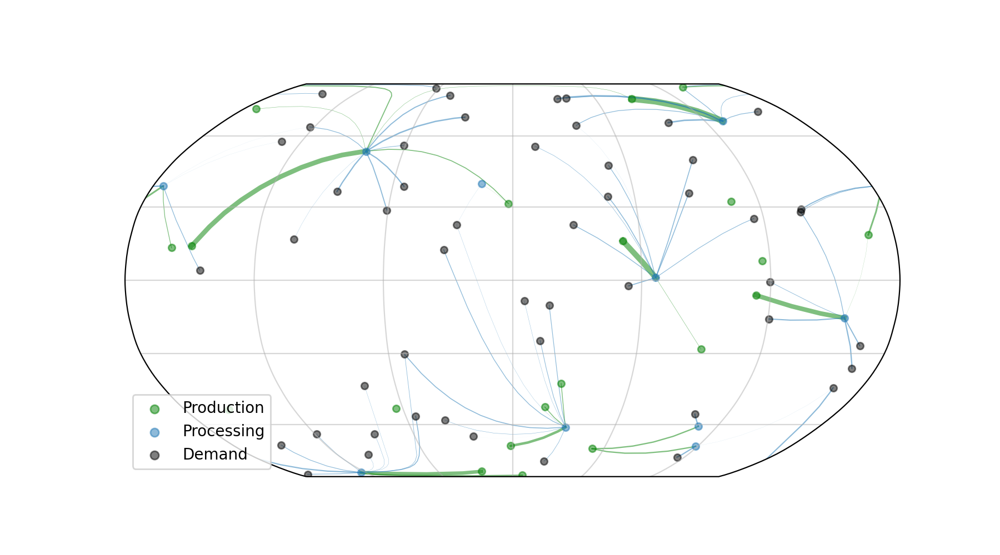

## Biomass Supply Chain Benchmark

 

Currently provides an automated way to formulate basic global supply chain problems with a user-specified number of production centres and demand nodes. 
A linear program is created in [Pyomo](http://www.pyomo.org), solved using [Ipopt](https://github.com/coin-or/Ipopt), and plotted using [Matplotlib](https://matplotlib.org) and [Cartopy](https://scitools.org.uk/cartopy/docs/v0.15/index.html) for projections of the globe. 

- _Optimization variables_ of the linear program are currently the amount of product distributed from each production centre to each demand zone. 
- _Constraints_ currently include maximum production limits and minimum demand fulfilment. 
- _The objective function_ is currently the cost per unit shipped, which assumes a shipping cost proportional to distance on a sphere. 
- Randomly _generated parameters_ are currently the production cost of each production centre per unit, locations of production centres and demand nodes, production limits for each production centre, and demand fulfilments for each demand node.
